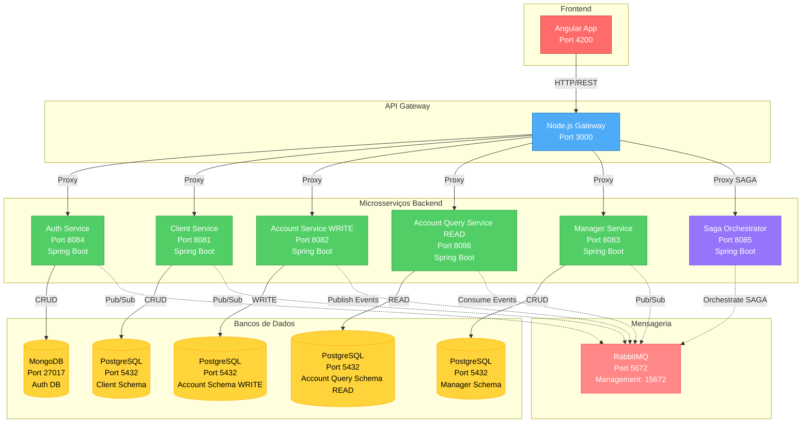
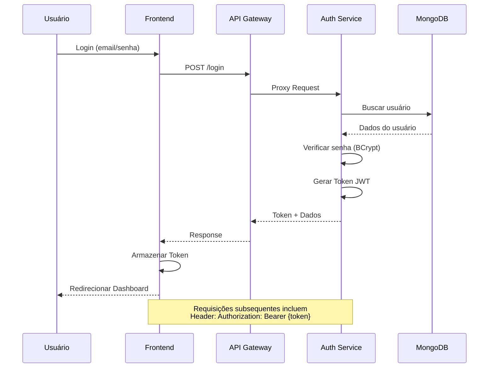
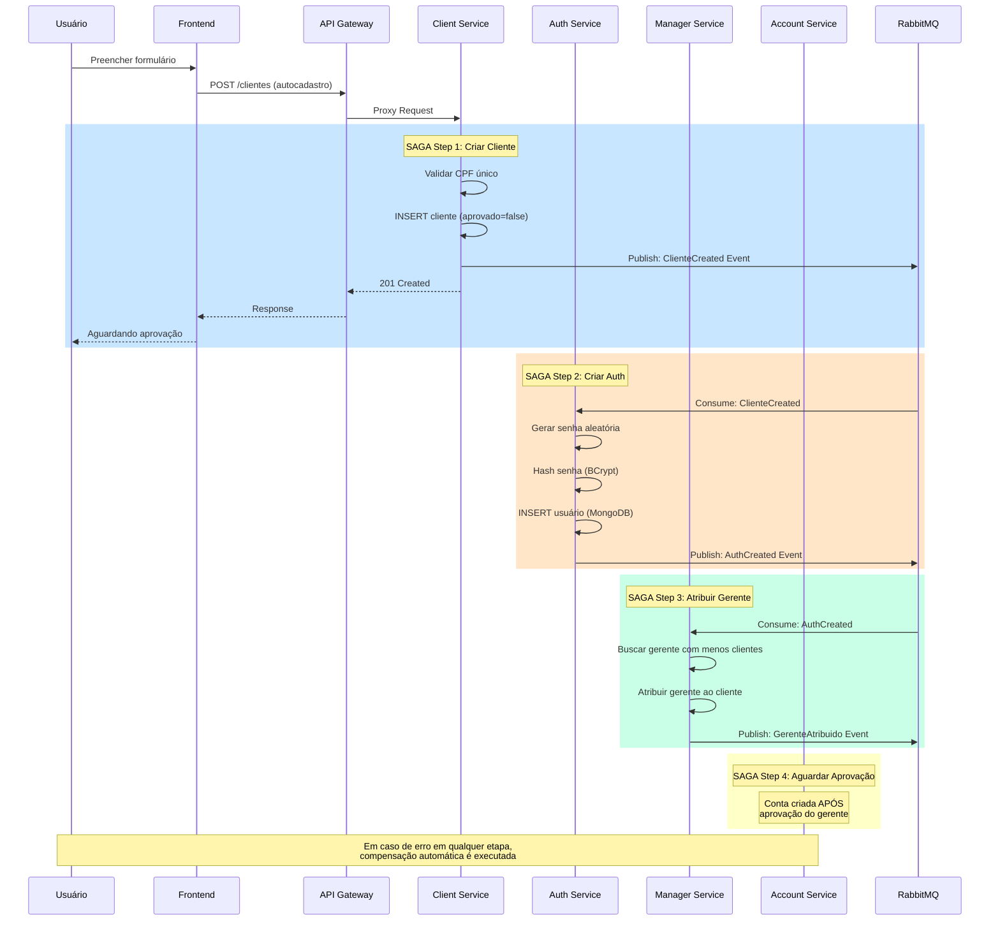
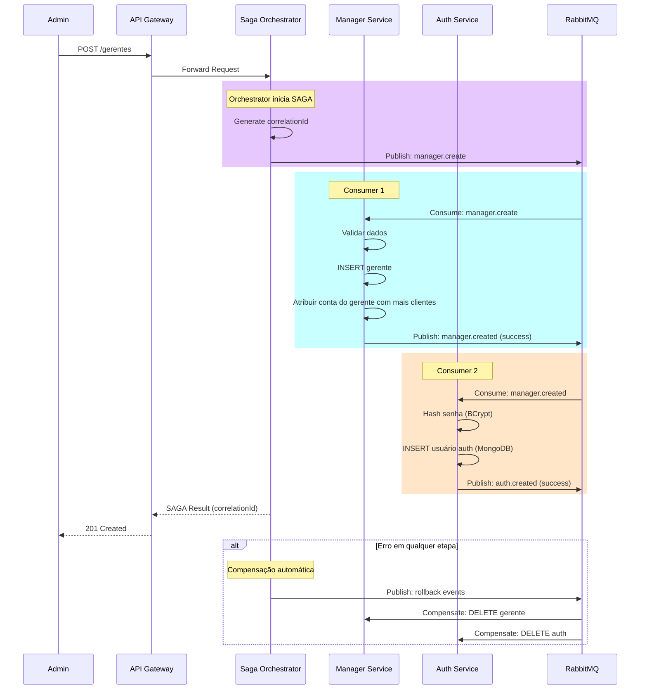
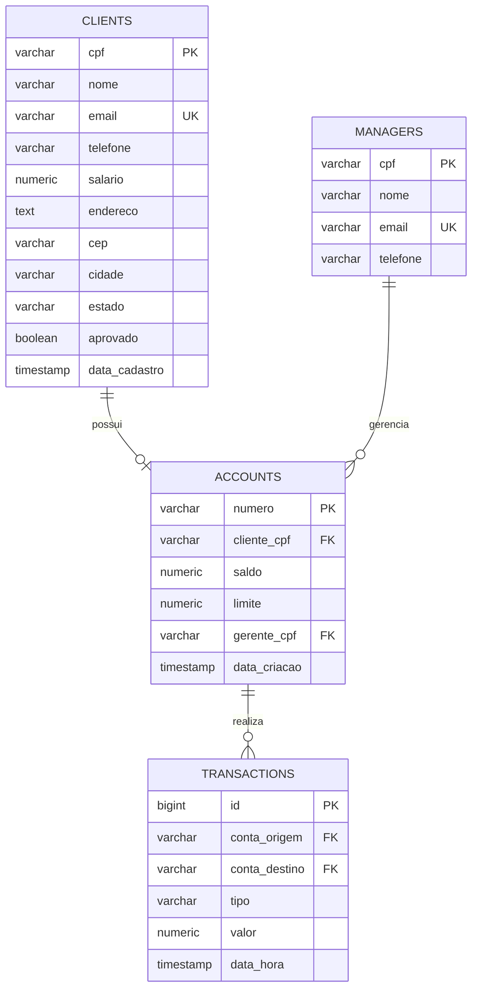

# 🏦 BANTADS - Internet Banking do TADS

[](https://www.oracle.com/java/)
[](https://spring.io/projects/spring-boot)
[](https://angular.io/)
[](https://nodejs.org/)
[](https://www.docker.com/)

Sistema de Internet Banking desenvolvido com arquitetura de microsserviços para a disciplina de Desenvolvimento de Aplicações Corporativas (DS152) da UFPR - TADS.

---

## 📋 Índice

-   [Sobre o Projeto](#-sobre-o-projeto)
-   [Arquitetura](#-arquitetura)
-   [Tecnologias Utilizadas](#-tecnologias-utilizadas)
-   [Pré-requisitos](#-pré-requisitos)
-   [Instalação e Execução](#-instalação-e-execução)
-   [Estrutura do Projeto](#-estrutura-do-projeto)
-   [Banco de Dados](#-banco-de-dados)
-   [Endpoints da API](#-endpoints-da-api)
-   [Usuários Pré-cadastrados](#-usuários-pré-cadastrados)
-   [Desenvolvimento](#-desenvolvimento)
-   [Troubleshooting](#-troubleshooting)

---

## 🎯 Sobre o Projeto

BANTADS é um sistema de Internet Banking completo que implementa os seguintes padrões de arquitetura de microsserviços:

-   ✅ **Arquitetura de Microsserviços**: Sistema distribuído e escalável
-   ✅ **API Gateway**: Ponto único de entrada para todos os serviços
-   ✅ **Database per Service**: Cada microsserviço possui seu próprio banco de dados
-   ✅ **CQRS**: Command Query Responsibility Segregation no serviço de Conta
-   ✅ **SAGA Orquestrada**: Transações distribuídas com compensação
-   ✅ **API Composition**: Agregação de resultados de múltiplos serviços

### Perfis de Usuário

O sistema possui 3 perfis de acesso:

1. **Cliente** 👤: Usuários que realizam operações bancárias (depósito, saque, transferência, consulta de extrato)
2. **Gerente** 👨‍💼: Gerentes responsáveis pela aprovação de clientes e gerenciamento de contas
3. **Administrador** 👑: Administradores do sistema com acesso total (CRUD de gerentes, relatórios)

### ✨ Status de Implementação

#### Funcionalidades Implementadas (Backend)

**Autenticação & Autorização:**

-   ✅ R02: Login/Logout com JWT
-   ✅ Middleware de autenticação no API Gateway
-   ✅ Validação de roles por endpoint
-   ✅ Criptografia de senhas com BCrypt + Salt

**Cliente:**

-   ✅ R01: Autocadastro com SAGA orquestrada
-   ✅ R04: Alteração de perfil com SAGA
-   ✅ R12: Consultar todos os clientes (Gerente)
-   ✅ R13: Consultar cliente por CPF
-   ✅ Validação de CPF e email únicos

**Conta:**

-   ✅ R03: Consulta de saldo (CQRS - Query Side)
-   ✅ R05: Depósito (CQRS - Command Side)
-   ✅ R06: Saque (CQRS - Command Side)
-   ✅ R07: Transferência (CQRS - Command Side)
-   ✅ R08: Consulta de extrato (CQRS - Query Side)
-   ✅ CQRS completo com sincronização via RabbitMQ
-   ✅ Validação de limites e saldos

**Gerente:**

-   ✅ R09: Tela inicial com clientes pendentes
-   ✅ R10: Aprovar cliente
-   ✅ R11: Rejeitar cliente
-   ✅ R14: Top 3 melhores clientes
-   ✅ R15: Dashboard de gerentes (Administrador)
-   ✅ R17: Inserção de gerente com SAGA
-   ✅ R18: Remoção de gerente
-   ✅ R19: Listagem de gerentes
-   ✅ R20: Alteração de gerente com SAGA

**SAGA Orquestrada:**

-   ✅ Autocadastro: Client → Auth → Manager → Account
-   ✅ Criação de Gerente: Manager → Auth
-   ✅ Atualização de Gerente: Manager → Auth
-   ✅ Atribuição automática de gerentes
-   ✅ Compensação em caso de falhas
-   ✅ Correlation IDs para rastreamento

**Padrões Implementados:**

-   ✅ API Gateway com proxy inteligente
-   ✅ API Composition para agregação de dados
-   ✅ Database per Service (schema-per-service)
-   ✅ CQRS com Event Sourcing
-   ✅ Event-Driven Architecture
-   ✅ Health checks em todos os serviços

---

## 🏗️ Arquitetura

### Diagrama de Arquitetura



### Microsserviços Implementados

#### 1. **API Gateway** (Node.js - Port 3000)

-   Ponto único de entrada para todos os serviços
-   Autenticação e autorização com JWT
-   Roteamento inteligente de requisições
-   API Composition para agregação de dados
-   Health checks de todos os serviços

#### 2. **Auth Service** (Spring Boot - Port 8084)

-   Autenticação de usuários (Login/Logout)
-   Geração e validação de tokens JWT
-   Gerenciamento de usuários (MongoDB)
-   Criptografia de senhas com BCrypt
-   Consumer RabbitMQ para criação/atualização de usuários via SAGA

#### 3. **Client Service** (Spring Boot - Port 8081)

-   CRUD de clientes
-   Autocadastro de novos clientes
-   Aprovação/Rejeição de clientes (Gerente)
-   Validação de CPF e email
-   Producer/Consumer RabbitMQ para SAGA de cadastro

#### 4. **Account Service - WRITE** (Spring Boot - Port 8082)

-   Implementação CQRS (Command side)
-   Operações de escrita: Depósito, Saque, Transferência
-   Criação de contas
-   Publicação de eventos no RabbitMQ para sincronização
-   Validação de limites e saldos

#### 5. **Account Query Service - READ** (Spring Boot - Port 8086)

-   Implementação CQRS (Query side)
-   Consulta de saldo
-   Consulta de extrato
-   Consumer RabbitMQ para sincronização do banco de leitura
-   Otimizado para consultas rápidas

#### 6. **Manager Service** (Spring Boot - Port 8083)

-   CRUD de gerentes
-   Atribuição automática de gerentes a clientes
-   Dashboard de gerentes
-   Relatórios gerenciais
-   Consumer RabbitMQ para operações via SAGA

#### 7. **Saga Orchestrator** (Spring Boot - Port 8085)

-   Orquestração de transações distribuídas
-   SAGA para criação de gerentes (Manager + Auth)
-   SAGA para atualização de gerentes (Manager + Auth)
-   SAGA para autocadastro (Client + Auth + Account + Manager)
-   Compensação automática em caso de falha
-   Publicação de eventos coordenados via RabbitMQ

### Fluxo de Autenticação



### Fluxo de Autocadastro (SAGA Orquestrada)



### Fluxo SAGA - Criação de Gerente (Orquestrada)



### Padrão CQRS - Account Service

````mermaid
graph LR
    subgraph "WRITE Side"
        CW[Commands<br/>POST /deposit<br/>POST /withdraw<br/>POST /transfer]
        AS[Account Service<br/>Port 8082]
        WDB[(PostgreSQL<br/>account_schema)]
    end

    subgraph "Message Broker"
        RMQ[RabbitMQ<br/>Events Queue]
    end

    subgraph "READ Side"
        CR[Queries<br/>GET /my-account<br/>GET /statement]
        AQS[Account Query Service<br/>Port 8086]
        RDB[(PostgreSQL<br/>account_query_schema)]
    end

    CW --> AS
    AS -->|WRITE| WDB
    AS -->|Publish Events| RMQ
    RMQ -->|Consume Events| AQS
    AQS -->|UPDATE| RDB
    CR --> AQS
    AQS -->|READ| RDB

    style AS fill:#ff6b6b,stroke:#c92a2a,color:#fff
    style AQS fill:#51cf66,stroke:#2f9e44,color:#fff
    style RMQ fill:#ffd43b,stroke:#fab005,color:#000
```---

## 🛠️ Tecnologias Utilizadas

### Frontend

-   **Angular 19.2**: Framework principal
-   **TypeScript**: Linguagem de programação
-   **RxJS**: Programação reativa
-   **Tailwind CSS**: Estilização
-   **Chart.js / ngx-charts**: Visualização de dados
-   **SweetAlert2**: Alertas e modais

### Backend

-   **Spring Boot 3.5.6**: Framework Java
-   **Spring Data JPA**: ORM para PostgreSQL
-   **Spring Data MongoDB**: Driver para MongoDB
-   **Spring Security**: Autenticação e autorização
-   **Spring AMQP**: Integração com RabbitMQ
-   **JWT (io.jsonwebtoken)**: Tokens de autenticação
-   **BCrypt**: Criptografia de senhas

### API Gateway

-   **Node.js 24**: Runtime JavaScript
-   **Express 5.1**: Framework web
-   **express-http-proxy**: Proxy reverso
-   **jsonwebtoken**: Validação de JWT
-   **CORS**: Controle de acesso

### Bancos de Dados

-   **PostgreSQL 14**: Banco relacional (serviços transacionais)
-   **MongoDB 8**: Banco NoSQL (serviço de autenticação)

### Infraestrutura

-   **Docker & Docker Compose**: Containerização
-   **RabbitMQ 4**: Message broker para comunicação assíncrona e SAGA
-   **Maven**: Gerenciamento de dependências Java

### Padrões Arquiteturais Implementados

✅ **Arquitetura de Microsserviços**: 7 microsserviços independentes
✅ **API Gateway**: Ponto único de entrada (Node.js + Express)
✅ **Database per Service**: Cada serviço tem seu próprio schema PostgreSQL
✅ **CQRS (Command Query Responsibility Segregation)**:
   - Account Service (Write) + Account Query Service (Read)
   - Sincronização via RabbitMQ

✅ **SAGA Orquestrada**:
   - Saga Orchestrator gerencia transações distribuídas
   - Autocadastro: Client → Auth → Manager → Account
   - Criação de Gerente: Manager → Auth
   - Atualização de Gerente: Manager → Auth
   - Compensação automática em falhas

✅ **API Composition**:
   - Agregação de dados de múltiplos serviços no API Gateway
   - Exemplo: `/relatorio/cliente-detalhado/:cpf` (Client + Account)

✅ **Event-Driven Architecture**:
   - RabbitMQ para comunicação assíncrona
   - Publishers/Consumers em todos os serviços
   - Exchanges e Queues dedicadas por domínio

---

## ✅ Pré-requisitos

Antes de começar, certifique-se de ter instalado:

-   ✅ **Docker Desktop** (versão 20.10 ou superior)
-   ✅ **Docker Compose** (versão 2.0 ou superior)
-   ✅ **Node.js** (versão 20 ou superior) - apenas para desenvolvimento local do frontend
-   ✅ **Java JDK 21** - apenas para desenvolvimento local do backend
-   ✅ **Maven 3.9+** - apenas para build local dos microsserviços
-   ✅ **Git** - para clonar o repositório

### Verificar instalações:

```bash
# Docker
docker --version
docker compose version

# Node.js (opcional)
node --version
npm --version

# Java (opcional)
java --version
mvn --version
````

---

## 🚀 Instalação e Execução

### Opção 1: Execução Completa com Docker (Recomendado)

Esta é a forma mais simples de executar o projeto completo.

#### 1. Clone o repositório

```bash
git clone https://github.com/VictorPBilbao/ProjetoFinalDAC.git
cd ProjetoFinalDAC
```

#### 2. Compile os microsserviços Java

Antes de iniciar os containers, é necessário compilar os microsserviços:

```bash
# Compilar Client Service
cd bantads-backend/client-service
./mvnw clean package -DskipTests
cd ../..

# Compilar Auth Service
cd bantads-backend/auth-service
./mvnw clean package -DskipTests
cd ../..

# Compilar Account Service (Write)
cd bantads-backend/account-service
./mvnw clean package -DskipTests
cd ../..

# Compilar Account Query Service (Read - CQRS)
cd bantads-backend/account-query-service
./mvnw clean package -DskipTests
cd ../..

# Compilar Manager Service
cd bantads-backend/manager-service
./mvnw clean package -DskipTests
cd ../..

# Compilar Saga Orchestrator
cd bantads-backend/saga-orchestrator
./mvnw clean package -DskipTests
cd ../..
```

**No Windows (PowerShell):**

```powershell
# Compilar Client Service
cd bantads-backend\client-service
.\mvnw.cmd clean package -DskipTests
cd ..\..

# Compilar Auth Service
cd bantads-backend\auth-service
.\mvnw.cmd clean package -DskipTests
cd ..\..

# Compilar Account Service (Write)
cd bantads-backend\account-service
.\mvnw.cmd clean package -DskipTests
cd ..\..

# Compilar Account Query Service (Read - CQRS)
cd bantads-backend\account-query-service
.\mvnw.cmd clean package -DskipTests
cd ..\..

# Compilar Manager Service
cd bantads-backend\manager-service
.\mvnw.cmd clean package -DskipTests
cd ..\..

# Compilar Saga Orchestrator
cd bantads-backend\saga-orchestrator
.\mvnw.cmd clean package -DskipTests
cd ..\..
```

#### 3. Iniciar todos os serviços

```bash
docker compose up --build
```

Ou em modo detached (segundo plano):

```bash
docker compose up -d --build
```

#### 4. Aguardar inicialização

Os serviços levam alguns minutos para inicializar completamente. Aguarde até ver as mensagens:

```
✅ bantads-postgres is ready
✅ bantads-mongodb is ready
✅ bantads-rabbitmq is ready
✅ bantads-auth-service started (Port 8084)
✅ bantads-client-service started (Port 8081)
✅ bantads-account-service started (Port 8082)
✅ bantads-account-query-service started (Port 8086)
✅ bantads-manager-service started (Port 8083)
✅ bantads-saga-orchestrator started (Port 8085)
✅ bantads-api-gateway is listening on port 3000
```

**Ordem de Inicialização:**

1. PostgreSQL, MongoDB, RabbitMQ (infraestrutura)
2. Auth Service, Client Service, Manager Service (serviços base)
3. Account Service (Write), Account Query Service (Read) - CQRS
4. Saga Orchestrator (orquestração de transações)
5. API Gateway (ponto de entrada)

#### 5. Acessar a aplicação

-   **Frontend**: http://localhost:4200 (se estiver rodando separadamente)
-   **API Gateway**: http://localhost:3000
-   **API Gateway Health**: http://localhost:3000/health
-   **RabbitMQ Management**: http://localhost:15672 (usuário: `guest`, senha: `guest`)
-   **PostgreSQL**: localhost:5432 (usuário: `postgres`, senha: `postgres`)
-   **MongoDB**: localhost:27017 (usuário: `mongo`, senha: `mongo`)

**Microsserviços (acesso direto - apenas desenvolvimento):**

-   Client Service: http://localhost:8081
-   Account Service (Write): http://localhost:8082
-   Manager Service: http://localhost:8083
-   Auth Service: http://localhost:8084
-   Saga Orchestrator: http://localhost:8085
-   Account Query Service (Read): http://localhost:8086

#### 6. Parar os serviços

```bash
# Parar sem remover containers
docker compose stop

# Parar e remover containers
docker compose down

# Parar, remover containers e volumes (RESET COMPLETO)
docker compose down -v
```

---

### Opção 2: Execução Individual dos Serviços

Para desenvolvimento, você pode executar cada serviço separadamente.

#### 1. Iniciar apenas os bancos de dados e RabbitMQ

```bash
docker compose up postgres mongodb rabbitmq -d
```

#### 2. Executar Auth Service localmente

```bash
cd bantads-backend/auth-service
./mvnw spring-boot:run
```

#### 3. Executar Client Service localmente

```bash
cd bantads-backend/client-service
./mvnw spring-boot:run
```

#### 4. Executar Account Service (Write) localmente

```bash
cd bantads-backend/account-service
./mvnw spring-boot:run
```

#### 5. Executar Account Query Service (Read) localmente

```bash
cd bantads-backend/account-query-service
./mvnw spring-boot:run
```

#### 6. Executar Manager Service localmente

```bash
cd bantads-backend/manager-service
./mvnw spring-boot:run
```

#### 7. Executar Saga Orchestrator localmente

```bash
cd bantads-backend/saga-orchestrator
./mvnw spring-boot:run
```

#### 8. Executar API Gateway localmente

```bash
cd bantads-backend/api-gateway
npm install
npm start
```

#### 9. Executar Frontend localmente

```bash
cd bantads-frontend
npm install
ng serve
```

Acesse: http://localhost:4200

---

## 📁 Estrutura do Projeto

```
ProjetoFinalDAC/
│
├── 📄 docker-compose.yml           # Orquestração de todos os containers
├── 📄 README.md                    # Este arquivo
│
├── 📁 api/
│   └── 📁 apidog/
│       └── 📄 openapi.json         # Especificação OpenAPI da API
│
├── 📁 bantads-backend/
│   ├── 📁 api-gateway/             # API Gateway (Node.js - Port 3000)
│   │   ├── 📄 Dockerfile
│   │   ├── 📄 package.json
│   │   ├── 📄 server.js            # Servidor principal com proxy e API composition
│   │   └── 📁 middleware/
│   │       └── 📄 auth.js          # Middleware de autenticação JWT
│   │
│   ├── 📁 auth-service/            # Microsserviço de Autenticação (Port 8084)
│   │   ├── 📄 Dockerfile
│   │   ├── 📄 pom.xml              # Spring Boot 3.5.6 + MongoDB
│   │   └── 📁 src/
│   │       └── 📁 main/
│   │           ├── 📁 java/br/ufpr/auth_service/
│   │           │   ├── 📁 controller/      # Login/Logout endpoints
│   │           │   ├── 📁 service/         # JWT generation/validation
│   │           │   ├── 📁 repository/      # MongoDB repositories
│   │           │   ├── 📁 model/           # User entity
│   │           │   ├── 📁 dto/             # Data Transfer Objects
│   │           │   ├── 📁 config/          # Security + JWT config
│   │           │   └── 📁 consumer/        # RabbitMQ consumers (SAGA)
│   │           └── 📁 resources/
│   │               └── 📄 application.properties
│   │
│   ├── 📁 client-service/          # Microsserviço de Clientes (Port 8081)
│   │   ├── 📄 Dockerfile
│   │   ├── 📄 pom.xml              # Spring Boot 3.5.6 + PostgreSQL
│   │   └── 📁 src/
│   │       └── 📁 main/
│   │           ├── 📁 java/br/ufpr/client_service/
│   │           │   ├── 📁 controller/      # Client CRUD endpoints
│   │           │   ├── 📁 service/         # Business logic
│   │           │   ├── 📁 repository/      # JPA repositories
│   │           │   ├── 📁 model/           # Client entity
│   │           │   ├── 📁 dto/             # DTOs
│   │           │   ├── 📁 config/          # RabbitMQ config
│   │           │   └── 📁 consumer/        # RabbitMQ consumers (SAGA)
│   │           └── 📁 resources/
│   │               └── 📄 application.properties
│   │
│   ├── 📁 account-service/         # Microsserviço de Contas - WRITE (Port 8082)
│   │   ├── 📄 Dockerfile           # CQRS - Command Side
│   │   ├── 📄 pom.xml              # Spring Boot 3.5.6 + PostgreSQL
│   │   └── 📁 src/
│   │       └── 📁 main/
│   │           ├── 📁 java/br/ufpr/account_service/
│   │           │   ├── 📁 controller/      # Deposit/Withdraw/Transfer
│   │           │   ├── 📁 service/         # Account operations
│   │           │   ├── 📁 repository/      # JPA repositories
│   │           │   ├── 📁 model/           # Account + Transaction entities
│   │           │   ├── 📁 dto/             # DTOs
│   │           │   ├── 📁 config/          # RabbitMQ config
│   │           │   └── 📁 consumer/        # RabbitMQ consumers (SAGA)
│   │           └── 📁 resources/
│   │               └── 📄 application.properties
│   │
│   ├── 📁 account-query-service/   # Microsserviço de Consulta de Contas - READ (Port 8086)
│   │   ├── 📄 Dockerfile           # CQRS - Query Side
│   │   ├── 📄 pom.xml              # Spring Boot 3.4.11 + PostgreSQL
│   │   └── 📁 src/
│   │       └── 📁 main/
│   │           ├── 📁 java/br/ufpr/account_query_service/
│   │           │   ├── 📁 controller/      # Balance/Statement queries
│   │           │   ├── 📁 service/         # Query optimization
│   │           │   ├── 📁 repository/      # Read-only repositories
│   │           │   ├── 📁 model/           # AccountView + TransactionView
│   │           │   ├── 📁 config/          # RabbitMQ config
│   │           │   └── 📁 consumer/        # Event consumers (CQRS sync)
│   │           └── 📁 resources/
│   │               └── 📄 application.properties
│   │
│   ├── 📁 manager-service/         # Microsserviço de Gerentes (Port 8083)
│   │   ├── 📄 Dockerfile
│   │   ├── 📄 pom.xml              # Spring Boot 3.5.6 + PostgreSQL
│   │   └── 📁 src/
│   │       └── 📁 main/
│   │           ├── 📁 java/br/ufpr/manager_service/
│   │           │   ├── 📁 controller/      # Manager CRUD + Dashboard
│   │           │   ├── 📁 service/         # Business logic
│   │           │   ├── 📁 repository/      # JPA repositories
│   │           │   ├── 📁 model/           # Manager entity
│   │           │   ├── 📁 dto/             # DTOs
│   │           │   ├── 📁 config/          # RabbitMQ config
│   │           │   └── 📁 consumer/        # RabbitMQ consumers (SAGA)
│   │           └── 📁 resources/
│   │               └── 📄 application.properties
│   │
│   └── 📁 saga-orchestrator/       # Orquestrador de SAGA (Port 8085)
│       ├── 📄 Dockerfile
│       ├── 📄 pom.xml              # Spring Boot 3.2.5 + WebFlux
│       └── 📁 src/
│           └── 📁 main/
│               ├── 📁 java/br/ufpr/saga_orchestrator/
│               │   ├── 📁 controller/      # SAGA endpoints
│               │   ├── 📁 service/         # Orchestration logic
│               │   ├── 📁 config/          # RabbitMQ config
│               │   └── 📁 result/          # SAGA result objects
│               └── 📁 resources/
│                   └── 📄 application.properties
│
├── 📁 bantads-frontend/            # Frontend Angular
│   ├── 📄 angular.json
│   ├── 📄 package.json
│   ├── 📄 tsconfig.json
│   └── 📁 src/
│       ├── 📄 index.html
│       ├── 📄 main.ts
│       └── 📁 app/
│           ├── 📁 features/
│           │   ├── 📁 components/
│           │   ├── 📁 models/
│           │   ├── 📁 pages/
│           │   ├── 📁 pages-admin/
│           │   ├── 📁 pages-customer/
│           │   ├── 📁 pages-manager/
│           │   └── 📁 services/
│           └── 📄 app.routes.ts
│
└── 📁 init-scripts/                # Scripts de inicialização
    ├── 📁 mongodb/
    │   └── 📄 init-mongo.js        # Inicialização do MongoDB com usuários
    └── 📁 postgres/
        └── 📄 01-init-schemas.sql  # Schemas para cada microsserviço
```

---

## 🗄️ Banco de Dados

### PostgreSQL - Estrutura

O PostgreSQL utiliza o padrão **Schema-per-Service** para isolar os dados de cada microsserviço.

#### Schema: `client_schema`

```sql
CREATE SCHEMA IF NOT EXISTS client_schema;

CREATE TABLE client_schema.clients (
    cpf VARCHAR(11) PRIMARY KEY,
    nome VARCHAR(100) NOT NULL,
    email VARCHAR(100) UNIQUE NOT NULL,
    telefone VARCHAR(20),
    salario NUMERIC(10, 2) NOT NULL,
    endereco TEXT,
    cep VARCHAR(9),
    cidade VARCHAR(100),
    estado VARCHAR(2),
    aprovado BOOLEAN DEFAULT FALSE,
    data_cadastro TIMESTAMP DEFAULT CURRENT_TIMESTAMP
);
```

#### Diagrama ER - PostgreSQL



### MongoDB - Estrutura

O MongoDB armazena os dados de autenticação no banco `bantads_auth`.

#### Collection: `users`

```javascript
{
  "_id": ObjectId("..."),
  "cpf": "12912861012",
  "nome": "Catharyna",
  "email": "cli1@bantads.com.br",
  "senha": "$2a$10$U0qjOCPVy/Sj3A3W9DCCkO7YSWDyPUYoHyRHkfRBpd0sXTvbEOgSG",
  "tipo": "CLIENTE",  // CLIENTE | GERENTE | ADMINISTRADOR
  "ativo": true,
  "createdAt": ISODate("2000-01-01T00:00:00.000Z"),
  "updatedAt": ISODate("2000-01-01T00:00:00.000Z")
}
```

#### Índices

```javascript
// Índice único no email (para login)
db.users.createIndex({ email: 1 }, { unique: true });

// Índice único no CPF
db.users.createIndex({ cpf: 1 }, { unique: true });

// Índice no tipo (para filtros)
db.users.createIndex({ tipo: 1 });

// Índice em ativo
db.users.createIndex({ ativo: 1 });
```

### Acesso aos Bancos de Dados

#### PostgreSQL

```bash
# Acessar via docker
docker exec -it bantads-postgres psql -U postgres -d bantads

# Listar schemas
\dn

# Usar schema
SET search_path TO client_schema;

# Listar tabelas
\dt

# Consultar clientes
SELECT * FROM clients;
```

#### MongoDB

```bash
# Acessar via docker
docker exec -it bantads-mongodb mongosh -u mongo -p mongo

# Usar banco
use bantads_auth

# Listar usuários
db.users.find().pretty()

# Contar por tipo
db.users.aggregate([
  { $group: { _id: "$tipo", count: { $sum: 1 } } }
])
```

---

## 🌐 Endpoints da API

Todos os endpoints devem ser acessados através do **API Gateway** na porta **3000**.

### Autenticação

#### POST /login

Realiza login no sistema.

**Request:**

```json
{
    "email": "cli1@bantads.com.br",
    "senha": "tads"
}
```

**Response (200):**

```json
{
    "access_token": "eyJhbGciOiJIUzI1NiIsInR5cCI6IkpXVCJ9...",
    "token_type": "bearer",
    "tipo": "CLIENTE",
    "usuario": {
        "cpf": "12912861012",
        "nome": "Catharyna",
        "email": "cli1@bantads.com.br"
    }
}
```

#### POST /logout

Realiza logout do usuário.

**Headers:**

```
Authorization: Bearer {token}
```

**Response (200):**

```json
{
    "cpf": "12912861012",
    "nome": "Catharyna",
    "email": "cli1@bantads.com.br",
    "tipo": "CLIENTE"
}
```

---

### Clientes

#### GET /clientes

Consulta clientes (requer autenticação).

**Headers:**

```
Authorization: Bearer {token}
```

**Query Params:**

-   `filtro`: (opcional)
    -   `para_aprovar`: Clientes aguardando aprovação (GERENTE)
    -   `adm_relatorio_clientes`: Relatório completo (ADMINISTRADOR)
    -   `melhores_clientes`: Top 3 clientes (GERENTE)

**Response (200):**

```json
[
    {
        "cpf": "12912861012",
        "nome": "Catharyna",
        "email": "cli1@bantads.com.br",
        "telefone": "(41) 9 9999-1111",
        "endereco": "Rua das Flores, 100",
        "cidade": "Curitiba",
        "estado": "PR",
        "conta": "1291",
        "saldo": 800.0,
        "limite": 5000.0
    }
]
```

#### POST /clientes

Autocadastro de cliente (não requer autenticação).

**Request:**

```json
{
    "cpf": "12345678901",
    "nome": "João Silva",
    "email": "joao@example.com",
    "telefone": "(41) 99999-9999",
    "salario": 5000.0,
    "endereco": "Rua Exemplo, 123",
    "CEP": "80000-000",
    "cidade": "Curitiba",
    "estado": "PR"
}
```

**Response (201):**

```json
{
    "message": "Cadastro enviado para aprovação"
}
```

#### GET /clientes/{cpf}

Consulta um cliente específico.

**Headers:**

```
Authorization: Bearer {token}
```

**Response (200):**

```json
{
    "cpf": "12912861012",
    "nome": "Catharyna",
    "email": "cli1@bantads.com.br",
    "telefone": "(41) 9 9999-1111",
    "endereco": "Rua das Flores, 100",
    "cidade": "Curitiba",
    "estado": "PR",
    "salario": 10000.0,
    "conta": "1291",
    "saldo": 800.0,
    "limite": 5000.0,
    "gerente": "98574307084",
    "gerente_nome": "Geniéve",
    "gerente_email": "ger1@bantads.com.br"
}
```

#### PUT /clientes/{cpf}

Atualiza dados do perfil do cliente.

**Headers:**

```
Authorization: Bearer {token}
```

**Request:**

```json
{
    "nome": "Catharyna Silva",
    "email": "catharyna.nova@bantads.com.br",
    "salario": 12000.0,
    "endereco": "Rua Nova, 200",
    "CEP": "80010-000",
    "cidade": "Curitiba",
    "estado": "PR"
}
```

#### POST /clientes/{cpf}/aprovar

Aprova um cliente (GERENTE apenas).

**Headers:**

```
Authorization: Bearer {token}
```

**Response (200):**

```json
{
    "cliente": "12912861012",
    "numero": "1291",
    "saldo": 0.0,
    "limite": 5000.0,
    "gerente": "98574307084",
    "criacao": "2025-10-10T10:00:00-03:00"
}
```

#### POST /clientes/{cpf}/rejeitar

Rejeita um cliente (GERENTE apenas).

**Headers:**

```
Authorization: Bearer {token}
```

**Request:**

```json
{
    "motivo": "Renda insuficiente para abertura de conta"
}
```

---

### Contas

#### POST /contas/{numero}/saldo

Consulta o saldo de uma conta.

**Headers:**

```
Authorization: Bearer {token}
```

**Response (200):**

```json
{
    "cliente": "12912861012",
    "conta": "1291",
    "saldo": 800.0
}
```

#### POST /contas/{numero}/depositar

Realiza um depósito.

**Headers:**

```
Authorization: Bearer {token}
```

**Request:**

```json
{
    "valor": 500.0
}
```

**Response (200):**

```json
{
    "conta": "1291",
    "data": "2025-10-10T14:30:00-03:00",
    "saldo": 1300.0
}
```

#### POST /contas/{numero}/sacar

Realiza um saque.

**Headers:**

```
Authorization: Bearer {token}
```

**Request:**

```json
{
    "valor": 200.0
}
```

**Response (200):**

```json
{
    "conta": "1291",
    "data": "2025-10-10T14:35:00-03:00",
    "saldo": 1100.0
}
```

#### POST /contas/{numero}/transferir

Realiza uma transferência.

**Headers:**

```
Authorization: Bearer {token}
```

**Request:**

```json
{
    "destino": "0950",
    "valor": 300.0
}
```

**Response (200):**

```json
{
    "conta": "1291",
    "data": "2025-10-10T14:40:00-03:00",
    "destino": "0950",
    "saldo": 800.0,
    "valor": 300.0
}
```

#### POST /contas/{numero}/extrato

Consulta o extrato da conta.

**Headers:**

```
Authorization: Bearer {token}
```

**Request:**

```json
{
    "dataInicio": "2025-01-01",
    "dataFim": "2025-10-10"
}
```

**Response (200):**

```json
{
    "conta": "1291",
    "saldo": 800.0,
    "movimentacoes": [
        {
            "data": "2025-01-01T10:00:00-03:00",
            "tipo": "depósito",
            "origem": "1291",
            "destino": null,
            "valor": 1000.0
        },
        {
            "data": "2025-01-01T12:00:00-03:00",
            "tipo": "saque",
            "origem": "1291",
            "destino": null,
            "valor": 200.0
        }
    ]
}
```

---

### Gerentes

#### GET /gerentes

Lista todos os gerentes.

**Headers:**

```
Authorization: Bearer {token}
```

**Query Params:**

-   `filtro`: (opcional)
    -   `dashboard`: Dados para dashboard do administrador

**Response (200):**

```json
[
    {
        "cpf": "98574307084",
        "nome": "Geniéve",
        "email": "ger1@bantads.com.br",
        "tipo": "GERENTE"
    }
]
```

#### POST /gerentes

Insere um novo gerente (ADMINISTRADOR apenas).

**Headers:**

```
Authorization: Bearer {token}
```

**Request:**

```json
{
    "cpf": "12345678901",
    "nome": "Novo Gerente",
    "email": "novo.gerente@bantads.com.br",
    "tipo": "GERENTE",
    "senha": "senha123"
}
```

#### GET /gerentes/{cpf}

Consulta um gerente específico.

**Headers:**

```
Authorization: Bearer {token}
```

#### PUT /gerentes/{cpf}

Atualiza dados de um gerente.

**Headers:**

```
Authorization: Bearer {token}
```

**Request:**

```json
{
    "nome": "Geniéve Atualizada",
    "email": "genieve.nova@bantads.com.br",
    "senha": "novaSenha123"
}
```

#### DELETE /gerentes/{cpf}

Remove um gerente.

**Headers:**

```
Authorization: Bearer {token}
```

---

### Health Checks

#### GET /health

Verifica o status do API Gateway.

**Response (200):**

```json
{
    "status": "✅ API Gateway is running!",
    "timestamp": "2025-10-10T14:00:00.000Z",
    "services": {
        "client": "http://client-service:8081",
        "account": "http://account-service:8082",
        "manager": "http://manager-service:8083",
        "auth": "http://auth-service:8084"
    }
}
```

#### GET /health/auth

Verifica o status do Auth Service.

#### GET /health/client

Verifica o status do Client Service.

---

## 👥 Usuários Pré-cadastrados

### Clientes

| CPF         | Nome       | E-mail              | Senha | Salário      |
| ----------- | ---------- | ------------------- | ----- | ------------ |
| 12912861012 | Catharyna  | cli1@bantads.com.br | tads  | R$ 10.000,00 |
| 09506382000 | Cleuddônio | cli2@bantads.com.br | tads  | R$ 20.000,00 |
| 85733854057 | Catianna   | cli3@bantads.com.br | tads  | R$ 3.000,00  |
| 58872160006 | Cutardo    | cli4@bantads.com.br | tads  | R$ 500,00    |
| 76179646090 | Coândrya   | cli5@bantads.com.br | tads  | R$ 1.500,00  |

### Gerentes

| CPF         | Nome       | E-mail              | Senha |
| ----------- | ---------- | ------------------- | ----- |
| 98574307084 | Geniéve    | ger1@bantads.com.br | tads  |
| 64065268052 | Godophredo | ger2@bantads.com.br | tads  |
| 23862179060 | Gyândula   | ger3@bantads.com.br | tads  |

### Administrador

| CPF         | Nome      | E-mail              | Senha |
| ----------- | --------- | ------------------- | ----- |
| 40501740066 | Adamântio | adm1@bantads.com.br | tads  |

---

## 💻 Desenvolvimento

### Executar Testes

#### Backend (Spring Boot)

```bash
# Client Service
cd bantads-backend/client-service
./mvnw test

# Auth Service
cd bantads-backend/auth-service
./mvnw test
```

#### Frontend (Angular)

```bash
cd bantads-frontend
npm test
```

### Build para Produção

#### Backend

```bash
# Client Service
cd bantads-backend/client-service
./mvnw clean package -DskipTests

# Auth Service
cd bantads-backend/auth-service
./mvnw clean package -DskipTests
```

Os arquivos `.jar` serão gerados em `target/`.

#### Frontend

```bash
cd bantads-frontend
npm run build
```

Os arquivos otimizados serão gerados em `dist/`.

### Variáveis de Ambiente

#### API Gateway (.env)

```env
PORT=3000
CLIENT_SERVICE_URL=http://client-service:8081
ACCOUNT_SERVICE_URL=http://account-service:8082
MANAGER_SERVICE_URL=http://manager-service:8083
AUTH_SERVICE_URL=http://auth-service:8084
JWT_SECRET=your-super-secret-jwt-key-change-in-production-12345
```

#### Auth Service (application.properties)

```properties
server.port=8084

# MongoDB
spring.data.mongodb.host=mongodb
spring.data.mongodb.port=27017
spring.data.mongodb.database=bantads_auth
spring.data.mongodb.username=mongo
spring.data.mongodb.password=mongo
spring.data.mongodb.authentication-database=admin

# JWT
jwt.secret=your-super-secret-jwt-key-change-in-production-12345
jwt.expiration=86400000
```

#### Client Service (application.properties)

```properties
server.port=8081

# PostgreSQL
spring.datasource.url=jdbc:postgresql://postgres:5432/bantads
spring.datasource.username=postgres
spring.datasource.password=postgres

# JPA
spring.jpa.hibernate.ddl-auto=none
spring.jpa.properties.hibernate.default_schema=client_schema

# RabbitMQ
spring.rabbitmq.host=rabbitmq
spring.rabbitmq.port=5672
spring.rabbitmq.username=guest
spring.rabbitmq.password=guest
```

---

## 🔧 Troubleshooting

### Problema: Containers não iniciam

**Solução:**

```bash
# Verificar logs
docker compose logs

# Verificar logs de um serviço específico
docker compose logs auth-service

# Remover containers e volumes
docker compose down -v

# Reconstruir do zero
docker compose up --build --force-recreate
```

### Problema: Erro de conexão com banco de dados

**Solução:**

```bash
# Verificar se os bancos estão rodando
docker ps

# Testar conexão PostgreSQL
docker exec -it bantads-postgres psql -U postgres -d bantads -c "SELECT 1"

# Testar conexão MongoDB
docker exec -it bantads-mongodb mongosh -u mongo -p mongo --eval "db.adminCommand('ping')"
```

### Problema: Porta já em uso

**Erro:**

```
Error: bind: address already in use
```

**Solução:**

```bash
# Windows - Encontrar processo na porta
netstat -ano | findstr :3000

# Matar processo (substitua PID)
taskkill /PID <PID> /F

# Ou alterar a porta no docker-compose.yml
```

### Problema: Maven não encontrado nos containers

**Solução:**
Certifique-se de compilar os serviços ANTES de rodar `docker compose up`:

```bash
cd bantads-backend/client-service
./mvnw clean package -DskipTests
cd ../..

cd bantads-backend/auth-service
./mvnw clean package -DskipTests
cd ../..
```

### Problema: Token JWT inválido

**Solução:**

1. Verifique se o `JWT_SECRET` é o mesmo no API Gateway e nos serviços
2. Faça logout e login novamente
3. Limpe o localStorage do navegador:
    ```javascript
    localStorage.clear();
    ```

### Problema: RabbitMQ não está processando mensagens

**Solução:**

```bash
# Acessar management console
# http://localhost:15672
# Usuário: guest / Senha: guest

# Verificar filas e exchanges
# Verificar se há mensagens mortas (dead letter queue)

# Reiniciar RabbitMQ
docker compose restart rabbitmq
```

### Problema: Frontend não conecta ao backend

**Solução:**

1. Verifique se o API Gateway está rodando: http://localhost:3000/health
2. Verifique o CORS no arquivo `server.js` do API Gateway
3. Verifique a URL da API no frontend (geralmente em `environment.ts`)

---

## 📚 Recursos Adicionais

### Documentação Oficial

-   [Spring Boot Documentation](https://spring.io/projects/spring-boot)
-   [Angular Documentation](https://angular.io/docs)
-   [Docker Documentation](https://docs.docker.com/)
-   [RabbitMQ Documentation](https://www.rabbitmq.com/documentation.html)
-   [PostgreSQL Documentation](https://www.postgresql.org/docs/)
-   [MongoDB Documentation](https://docs.mongodb.com/)

### Padrões de Microsserviços

-   [Microservices Patterns](https://microservices.io/patterns/index.html)
-   [SAGA Pattern](https://microservices.io/patterns/data/saga.html)
-   [CQRS Pattern](https://microservices.io/patterns/data/cqrs.html)
-   [API Gateway Pattern](https://microservices.io/patterns/apigateway.html)

---

## 📝 Licença

Este projeto foi desenvolvido para fins educacionais na UFPR - Universidade Federal do Paraná.

---

## 👨‍💻 Autores

Desenvolvido por alunos do curso de Tecnologia em Análise e Desenvolvimento de Sistemas (TADS) da UFPR.

**Disciplina:** DS152 - Desenvolvimento de Aplicações Corporativas  
**Professor:** Razer Anthom Nizer Rojas Montaño
**Ano:** 2025

---

## 🎓 Agradecimentos

-   Universidade Federal do Paraná (UFPR)
-   Professores e colegas do curso TADS

---

**🚀 Bom desenvolvimento!**

Para dúvidas ou problemas, abra uma issue no GitHub ou entre em contato com a equipe.
