# 🏦 BANTADS - Internet Banking do TADS

[](https://www.oracle.com/java/)
[](https://spring.io/projects/spring-boot)
[](https://angular.io/)
[](https://nodejs.org/)
[](https://www.docker.com/)

Sistema de Internet Banking desenvolvido com arquitetura de microsserviços para a disciplina de Desenvolvimento de Aplicações Corporativas (DS152) da UFPR - TADS.

---

## 📋 Índice

- [Sobre o Projeto](#-sobre-o-projeto)
- [Arquitetura](#-arquitetura)
- [Tecnologias Utilizadas](#-tecnologias-utilizadas)
- [Pré-requisitos](#-pré-requisitos)
- [Instalação e Execução](#-instalação-e-execução)
- [Estrutura do Projeto](#-estrutura-do-projeto)
- [Banco de Dados](#-banco-de-dados)
- [Endpoints da API](#-endpoints-da-api)
- [Usuários Pré-cadastrados](#-usuários-pré-cadastrados)
- [Desenvolvimento](#-desenvolvimento)
- [Troubleshooting](#-troubleshooting)

---

## 🎯 Sobre o Projeto

BANTADS é um sistema de Internet Banking completo que implementa os seguintes padrões de arquitetura de microsserviços:

- ✅ **Arquitetura de Microsserviços**: Sistema distribuído e escalável
- ✅ **API Gateway**: Ponto único de entrada para todos os serviços
- ✅ **Database per Service**: Cada microsserviço possui seu próprio banco de dados
- ✅ **CQRS**: Command Query Responsibility Segregation no serviço de Conta
- ✅ **SAGA Orquestrada**: Transações distribuídas com compensação
- ✅ **API Composition**: Agregação de resultados de múltiplos serviços

### Perfis de Usuário

O sistema possui 3 perfis de acesso:

1. **Cliente** 👤: Usuários que realizam operações bancárias (depósito, saque, transferência, consulta de extrato)
2. **Gerente** 👨‍💼: Gerentes responsáveis pela aprovação de clientes e gerenciamento de contas
3. **Administrador** 👑: Administradores do sistema com acesso total (CRUD de gerentes, relatórios)

---

## 🏗️ Arquitetura

### Diagrama de Arquitetura

```mermaid
graph TB
    subgraph "Frontend"
        A[Angular App<br/>Port 4200]
    end
    
    subgraph "API Gateway"
        B[Node.js Gateway<br/>Port 3000]
    end
    
    subgraph "Microsserviços Backend"
        C[Auth Service<br/>Port 8084<br/>Spring Boot]
        D[Client Service<br/>Port 8081<br/>Spring Boot]
        E[Account Service<br/>Port 8082<br/>Spring Boot]
        F[Manager Service<br/>Port 8083<br/>Spring Boot]
    end
    
    subgraph "Bancos de Dados"
        G[(MongoDB<br/>Port 27017<br/>Auth DB)]
        H[(PostgreSQL<br/>Port 5432<br/>Client Schema)]
        I[(PostgreSQL<br/>Port 5432<br/>Account Schema)]
        J[(PostgreSQL<br/>Port 5432<br/>Manager Schema)]
    end
    
    subgraph "Mensageria"
        K[RabbitMQ<br/>Port 5672<br/>Management: 15672]
    end
    
    A -->|HTTP/REST| B
    B -->|Proxy| C
    B -->|Proxy| D
    B -->|Proxy| E
    B -->|Proxy| F
    
    C -->|CRUD| G
    D -->|CRUD| H
    E -->|CRUD| I
    F -->|CRUD| J
    
    C -.->|Pub/Sub| K
    D -.->|Pub/Sub| K
    E -.->|Pub/Sub| K
    F -.->|Pub/Sub| K
    
    style A fill:#ff6b6b,stroke:#c92a2a,color:#fff
    style B fill:#4dabf7,stroke:#1971c2,color:#fff
    style C fill:#51cf66,stroke:#2f9e44,color:#fff
    style D fill:#51cf66,stroke:#2f9e44,color:#fff
    style E fill:#51cf66,stroke:#2f9e44,color:#fff
    style F fill:#51cf66,stroke:#2f9e44,color:#fff
    style G fill:#ffd43b,stroke:#fab005,color:#000
    style H fill:#ffd43b,stroke:#fab005,color:#000
    style I fill:#ffd43b,stroke:#fab005,color:#000
    style J fill:#ffd43b,stroke:#fab005,color:#000
    style K fill:#ff8787,stroke:#fa5252,color:#fff
```



### Fluxo de Autenticação

```mermaid
sequenceDiagram
    participant U as Usuário
    participant F as Frontend
    participant G as API Gateway
    participant A as Auth Service
    participant M as MongoDB
    
    U->>F: Login (email/senha)
    F->>G: POST /login
    G->>A: Proxy Request
    A->>M: Buscar usuário
    M-->>A: Dados do usuário
    A->>A: Verificar senha (BCrypt)
    A->>A: Gerar Token JWT
    A-->>G: Token + Dados
    G-->>F: Response
    F->>F: Armazenar Token
    F-->>U: Redirecionar Dashboard
    
    Note over F,A: Requisições subsequentes incluem<br/>Header: Authorization: Bearer {token}
```



### Fluxo de Autocadastro (SAGA)

```mermaid
sequenceDiagram
    participant U as Usuário
    participant F as Frontend
    participant G as API Gateway
    participant C as Client Service
    participant A as Auth Service
    participant AC as Account Service
    participant MG as Manager Service
    participant R as RabbitMQ
    participant DB as PostgreSQL/MongoDB
    
    U->>F: Preencher formulário
    F->>G: POST /clientes (autocadastro)
    G->>C: Proxy Request
    
    rect rgb(200, 230, 255)
        Note over C,DB: SAGA - Etapa 1: Criar Cliente
        C->>DB: INSERT cliente (aprovado=false)
        C->>R: Publicar evento: ClienteCreated
    end
    
    rect rgb(255, 230, 200)
        Note over A,DB: SAGA - Etapa 2: Criar Autenticação
        R->>A: Consumir: ClienteCreated
        A->>DB: INSERT usuário (MongoDB)
        A->>R: Publicar evento: AuthCreated
    end
    
    rect rgb(200, 255, 230)
        Note over MG,DB: SAGA - Etapa 3: Atribuir Gerente
        R->>MG: Consumir: AuthCreated
        MG->>DB: Buscar gerente com menos clientes
        MG->>R: Publicar evento: GerenteAtribuido
    end
    
    rect rgb(255, 240, 200)
        Note over AC,DB: SAGA - Etapa 4: Aguardar Aprovação
        Note over AC: Conta será criada após<br/>aprovação do gerente
    end
    
    C-->>G: Response: Cadastro enviado
    G-->>F: 201 Created
    F-->>U: Mensagem: Aguardando aprovação
```



---

## 🛠️ Tecnologias Utilizadas

### Frontend
- **Angular 19.2**: Framework principal
- **TypeScript**: Linguagem de programação
- **RxJS**: Programação reativa
- **Tailwind CSS**: Estilização
- **Chart.js / ngx-charts**: Visualização de dados
- **SweetAlert2**: Alertas e modais

### Backend
- **Spring Boot 3.5.6**: Framework Java
- **Spring Data JPA**: ORM para PostgreSQL
- **Spring Data MongoDB**: Driver para MongoDB
- **Spring Security**: Autenticação e autorização
- **Spring AMQP**: Integração com RabbitMQ
- **JWT (io.jsonwebtoken)**: Tokens de autenticação
- **BCrypt**: Criptografia de senhas

### API Gateway
- **Node.js 24**: Runtime JavaScript
- **Express 5.1**: Framework web
- **express-http-proxy**: Proxy reverso
- **jsonwebtoken**: Validação de JWT
- **CORS**: Controle de acesso

### Bancos de Dados
- **PostgreSQL 14**: Banco relacional (serviços transacionais)
- **MongoDB 8**: Banco NoSQL (serviço de autenticação)

### Infraestrutura
- **Docker & Docker Compose**: Containerização
- **RabbitMQ 4**: Message broker
- **Maven**: Gerenciamento de dependências Java

---

## ✅ Pré-requisitos

Antes de começar, certifique-se de ter instalado:

- ✅ **Docker Desktop** (versão 20.10 ou superior)
- ✅ **Docker Compose** (versão 2.0 ou superior)
- ✅ **Node.js** (versão 20 ou superior) - apenas para desenvolvimento local do frontend
- ✅ **Java JDK 21** - apenas para desenvolvimento local do backend
- ✅ **Maven 3.9+** - apenas para build local dos microsserviços
- ✅ **Git** - para clonar o repositório

### Verificar instalações:

```bash
# Docker
docker --version
docker compose version

# Node.js (opcional)
node --version
npm --version

# Java (opcional)
java --version
mvn --version
```

---

## 🚀 Instalação e Execução

### Opção 1: Execução Completa com Docker (Recomendado)

Esta é a forma mais simples de executar o projeto completo.

#### 1. Clone o repositório

```bash
git clone https://github.com/VictorPBilbao/ProjetoFinalDAC.git
cd ProjetoFinalDAC
```

#### 2. Compile os microsserviços Java

Antes de iniciar os containers, é necessário compilar os microsserviços:

```bash
# Compilar Client Service
cd bantads-backend/client-service
./mvnw clean package -DskipTests
cd ../..

# Compilar Auth Service
cd bantads-backend/auth-service
./mvnw clean package -DskipTests
cd ../..
```

**No Windows (PowerShell):**
```powershell
# Compilar Client Service
cd bantads-backend\client-service
.\mvnw.cmd clean package -DskipTests
cd ..\..

# Compilar Auth Service
cd bantads-backend\auth-service
.\mvnw.cmd clean package -DskipTests
cd ..\..
```

#### 3. Iniciar todos os serviços

```bash
docker compose up --build
```

Ou em modo detached (segundo plano):
```bash
docker compose up -d --build
```

#### 4. Aguardar inicialização

Os serviços levam alguns minutos para inicializar completamente. Aguarde até ver as mensagens:

```
✅ bantads-postgres is ready
✅ bantads-mongodb is ready
✅ bantads-rabbitmq is ready
✅ bantads-auth-service started
✅ bantads-client-service started
✅ bantads-api-gateway is listening on port 3000
```

#### 5. Acessar a aplicação

- **Frontend**: http://localhost:4200 (se estiver rodando separadamente)
- **API Gateway**: http://localhost:3000
- **RabbitMQ Management**: http://localhost:15672 (usuário: `guest`, senha: `guest`)

#### 6. Parar os serviços

```bash
# Parar sem remover containers
docker compose stop

# Parar e remover containers
docker compose down

# Parar, remover containers e volumes (RESET COMPLETO)
docker compose down -v
```

---

### Opção 2: Execução Individual dos Serviços

Para desenvolvimento, você pode executar cada serviço separadamente.

#### 1. Iniciar apenas os bancos de dados e RabbitMQ

```bash
docker compose up postgres mongodb rabbitmq -d
```

#### 2. Executar Auth Service localmente

```bash
cd bantads-backend/auth-service
./mvnw spring-boot:run
```

#### 3. Executar Client Service localmente

```bash
cd bantads-backend/client-service
./mvnw spring-boot:run
```

#### 4. Executar API Gateway localmente

```bash
cd bantads-backend/api-gateway
npm install
npm start
```

#### 5. Executar Frontend localmente

```bash
cd bantads-frontend
npm install
ng serve
```

Acesse: http://localhost:4200

---

## 📁 Estrutura do Projeto

```
ProjetoFinalDAC/
│
├── 📄 docker-compose.yml           # Orquestração de todos os containers
├── 📄 README.md                    # Este arquivo
│
├── 📁 api/
│   └── 📁 apidog/
│       └── 📄 openapi.json         # Especificação OpenAPI da API
│
├── 📁 bantads-backend/
│   ├── 📁 api-gateway/             # API Gateway (Node.js)
│   │   ├── 📄 Dockerfile
│   │   ├── 📄 package.json
│   │   ├── 📄 server.js            # Servidor principal
│   │   └── 📁 middleware/
│   │       └── 📄 auth.js          # Middleware de autenticação JWT
│   │
│   ├── 📁 auth-service/            # Microsserviço de Autenticação
│   │   ├── 📄 Dockerfile
│   │   ├── 📄 pom.xml              # Dependências Maven
│   │   └── 📁 src/
│   │       └── 📁 main/
│   │           ├── 📁 java/br/ufpr/...
│   │           └── 📁 resources/
│   │               └── 📄 application.properties
│   │
│   └── 📁 client-service/          # Microsserviço de Clientes
│       ├── 📄 Dockerfile
│       ├── 📄 pom.xml
│       └── 📁 src/
│           └── 📁 main/
│               ├── 📁 java/br/ufpr/...
│               └── 📁 resources/
│                   └── 📄 application.properties
│
├── 📁 bantads-frontend/            # Frontend Angular
│   ├── 📄 angular.json
│   ├── 📄 package.json
│   ├── 📄 tsconfig.json
│   └── 📁 src/
│       ├── 📄 index.html
│       ├── 📄 main.ts
│       └── 📁 app/
│           ├── 📁 features/
│           │   ├── 📁 components/
│           │   ├── 📁 models/
│           │   ├── 📁 pages/
│           │   ├── 📁 pages-admin/
│           │   ├── 📁 pages-customer/
│           │   ├── 📁 pages-manager/
│           │   └── 📁 services/
│           └── 📄 app.routes.ts
│
└── 📁 init-scripts/                # Scripts de inicialização
    ├── 📁 mongodb/
    │   └── 📄 init-mongo.js        # Inicialização do MongoDB
    └── 📁 postgres/
        └── 📄 01-init-schemas.sql  # Inicialização do PostgreSQL
```

---

## 🗄️ Banco de Dados

### PostgreSQL - Estrutura

O PostgreSQL utiliza o padrão **Schema-per-Service** para isolar os dados de cada microsserviço.

#### Schema: `client_schema`

```sql
CREATE SCHEMA IF NOT EXISTS client_schema;

CREATE TABLE client_schema.clients (
    cpf VARCHAR(11) PRIMARY KEY,
    nome VARCHAR(100) NOT NULL,
    email VARCHAR(100) UNIQUE NOT NULL,
    telefone VARCHAR(20),
    salario NUMERIC(10, 2) NOT NULL,
    endereco TEXT,
    cep VARCHAR(9),
    cidade VARCHAR(100),
    estado VARCHAR(2),
    aprovado BOOLEAN DEFAULT FALSE,
    data_cadastro TIMESTAMP DEFAULT CURRENT_TIMESTAMP
);
```

#### Diagrama ER - PostgreSQL


### MongoDB - Estrutura

O MongoDB armazena os dados de autenticação no banco `bantads_auth`.

#### Collection: `users`

```javascript
{
  "_id": ObjectId("..."),
  "cpf": "12912861012",
  "nome": "Catharyna",
  "email": "cli1@bantads.com.br",
  "senha": "$2a$10$U0qjOCPVy/Sj3A3W9DCCkO7YSWDyPUYoHyRHkfRBpd0sXTvbEOgSG",
  "tipo": "CLIENTE",  // CLIENTE | GERENTE | ADMINISTRADOR
  "ativo": true,
  "createdAt": ISODate("2000-01-01T00:00:00.000Z"),
  "updatedAt": ISODate("2000-01-01T00:00:00.000Z")
}
```

#### Índices

```javascript
// Índice único no email (para login)
db.users.createIndex({ email: 1 }, { unique: true });

// Índice único no CPF
db.users.createIndex({ cpf: 1 }, { unique: true });

// Índice no tipo (para filtros)
db.users.createIndex({ tipo: 1 });

// Índice em ativo
db.users.createIndex({ ativo: 1 });
```

### Acesso aos Bancos de Dados

#### PostgreSQL

```bash
# Acessar via docker
docker exec -it bantads-postgres psql -U postgres -d bantads

# Listar schemas
\dn

# Usar schema
SET search_path TO client_schema;

# Listar tabelas
\dt

# Consultar clientes
SELECT * FROM clients;
```

#### MongoDB

```bash
# Acessar via docker
docker exec -it bantads-mongodb mongosh -u mongo -p mongo

# Usar banco
use bantads_auth

# Listar usuários
db.users.find().pretty()

# Contar por tipo
db.users.aggregate([
  { $group: { _id: "$tipo", count: { $sum: 1 } } }
])
```

---

## 🌐 Endpoints da API

Todos os endpoints devem ser acessados através do **API Gateway** na porta **3000**.

### Autenticação

#### POST /login
Realiza login no sistema.

**Request:**
```json
{
  "email": "cli1@bantads.com.br",
  "senha": "tads"
}
```

**Response (200):**
```json
{
  "access_token": "eyJhbGciOiJIUzI1NiIsInR5cCI6IkpXVCJ9...",
  "token_type": "bearer",
  "tipo": "CLIENTE",
  "usuario": {
    "cpf": "12912861012",
    "nome": "Catharyna",
    "email": "cli1@bantads.com.br"
  }
}
```

#### POST /logout
Realiza logout do usuário.

**Headers:**
```
Authorization: Bearer {token}
```

**Response (200):**
```json
{
  "cpf": "12912861012",
  "nome": "Catharyna",
  "email": "cli1@bantads.com.br",
  "tipo": "CLIENTE"
}
```

---

### Clientes

#### GET /clientes
Consulta clientes (requer autenticação).

**Headers:**
```
Authorization: Bearer {token}
```

**Query Params:**
- `filtro`: (opcional)
  - `para_aprovar`: Clientes aguardando aprovação (GERENTE)
  - `adm_relatorio_clientes`: Relatório completo (ADMINISTRADOR)
  - `melhores_clientes`: Top 3 clientes (GERENTE)

**Response (200):**
```json
[
  {
    "cpf": "12912861012",
    "nome": "Catharyna",
    "email": "cli1@bantads.com.br",
    "telefone": "(41) 9 9999-1111",
    "endereco": "Rua das Flores, 100",
    "cidade": "Curitiba",
    "estado": "PR",
    "conta": "1291",
    "saldo": 800.00,
    "limite": 5000.00
  }
]
```

#### POST /clientes
Autocadastro de cliente (não requer autenticação).

**Request:**
```json
{
  "cpf": "12345678901",
  "nome": "João Silva",
  "email": "joao@example.com",
  "telefone": "(41) 99999-9999",
  "salario": 5000.00,
  "endereco": "Rua Exemplo, 123",
  "CEP": "80000-000",
  "cidade": "Curitiba",
  "estado": "PR"
}
```

**Response (201):**
```json
{
  "message": "Cadastro enviado para aprovação"
}
```

#### GET /clientes/{cpf}
Consulta um cliente específico.

**Headers:**
```
Authorization: Bearer {token}
```

**Response (200):**
```json
{
  "cpf": "12912861012",
  "nome": "Catharyna",
  "email": "cli1@bantads.com.br",
  "telefone": "(41) 9 9999-1111",
  "endereco": "Rua das Flores, 100",
  "cidade": "Curitiba",
  "estado": "PR",
  "salario": 10000.00,
  "conta": "1291",
  "saldo": 800.00,
  "limite": 5000.00,
  "gerente": "98574307084",
  "gerente_nome": "Geniéve",
  "gerente_email": "ger1@bantads.com.br"
}
```

#### PUT /clientes/{cpf}
Atualiza dados do perfil do cliente.

**Headers:**
```
Authorization: Bearer {token}
```

**Request:**
```json
{
  "nome": "Catharyna Silva",
  "email": "catharyna.nova@bantads.com.br",
  "salario": 12000.00,
  "endereco": "Rua Nova, 200",
  "CEP": "80010-000",
  "cidade": "Curitiba",
  "estado": "PR"
}
```

#### POST /clientes/{cpf}/aprovar
Aprova um cliente (GERENTE apenas).

**Headers:**
```
Authorization: Bearer {token}
```

**Response (200):**
```json
{
  "cliente": "12912861012",
  "numero": "1291",
  "saldo": 0.00,
  "limite": 5000.00,
  "gerente": "98574307084",
  "criacao": "2025-10-10T10:00:00-03:00"
}
```

#### POST /clientes/{cpf}/rejeitar
Rejeita um cliente (GERENTE apenas).

**Headers:**
```
Authorization: Bearer {token}
```

**Request:**
```json
{
  "motivo": "Renda insuficiente para abertura de conta"
}
```

---

### Contas

#### POST /contas/{numero}/saldo
Consulta o saldo de uma conta.

**Headers:**
```
Authorization: Bearer {token}
```

**Response (200):**
```json
{
  "cliente": "12912861012",
  "conta": "1291",
  "saldo": 800.00
}
```

#### POST /contas/{numero}/depositar
Realiza um depósito.

**Headers:**
```
Authorization: Bearer {token}
```

**Request:**
```json
{
  "valor": 500.00
}
```

**Response (200):**
```json
{
  "conta": "1291",
  "data": "2025-10-10T14:30:00-03:00",
  "saldo": 1300.00
}
```

#### POST /contas/{numero}/sacar
Realiza um saque.

**Headers:**
```
Authorization: Bearer {token}
```

**Request:**
```json
{
  "valor": 200.00
}
```

**Response (200):**
```json
{
  "conta": "1291",
  "data": "2025-10-10T14:35:00-03:00",
  "saldo": 1100.00
}
```

#### POST /contas/{numero}/transferir
Realiza uma transferência.

**Headers:**
```
Authorization: Bearer {token}
```

**Request:**
```json
{
  "destino": "0950",
  "valor": 300.00
}
```

**Response (200):**
```json
{
  "conta": "1291",
  "data": "2025-10-10T14:40:00-03:00",
  "destino": "0950",
  "saldo": 800.00,
  "valor": 300.00
}
```

#### POST /contas/{numero}/extrato
Consulta o extrato da conta.

**Headers:**
```
Authorization: Bearer {token}
```

**Request:**
```json
{
  "dataInicio": "2025-01-01",
  "dataFim": "2025-10-10"
}
```

**Response (200):**
```json
{
  "conta": "1291",
  "saldo": 800.00,
  "movimentacoes": [
    {
      "data": "2025-01-01T10:00:00-03:00",
      "tipo": "depósito",
      "origem": "1291",
      "destino": null,
      "valor": 1000.00
    },
    {
      "data": "2025-01-01T12:00:00-03:00",
      "tipo": "saque",
      "origem": "1291",
      "destino": null,
      "valor": 200.00
    }
  ]
}
```

---

### Gerentes

#### GET /gerentes
Lista todos os gerentes.

**Headers:**
```
Authorization: Bearer {token}
```

**Query Params:**
- `filtro`: (opcional)
  - `dashboard`: Dados para dashboard do administrador

**Response (200):**
```json
[
  {
    "cpf": "98574307084",
    "nome": "Geniéve",
    "email": "ger1@bantads.com.br",
    "tipo": "GERENTE"
  }
]
```

#### POST /gerentes
Insere um novo gerente (ADMINISTRADOR apenas).

**Headers:**
```
Authorization: Bearer {token}
```

**Request:**
```json
{
  "cpf": "12345678901",
  "nome": "Novo Gerente",
  "email": "novo.gerente@bantads.com.br",
  "tipo": "GERENTE",
  "senha": "senha123"
}
```

#### GET /gerentes/{cpf}
Consulta um gerente específico.

**Headers:**
```
Authorization: Bearer {token}
```

#### PUT /gerentes/{cpf}
Atualiza dados de um gerente.

**Headers:**
```
Authorization: Bearer {token}
```

**Request:**
```json
{
  "nome": "Geniéve Atualizada",
  "email": "genieve.nova@bantads.com.br",
  "senha": "novaSenha123"
}
```

#### DELETE /gerentes/{cpf}
Remove um gerente.

**Headers:**
```
Authorization: Bearer {token}
```

---

### Health Checks

#### GET /health
Verifica o status do API Gateway.

**Response (200):**
```json
{
  "status": "✅ API Gateway is running!",
  "timestamp": "2025-10-10T14:00:00.000Z",
  "services": {
    "client": "http://client-service:8081",
    "account": "http://account-service:8082",
    "manager": "http://manager-service:8083",
    "auth": "http://auth-service:8084"
  }
}
```

#### GET /health/auth
Verifica o status do Auth Service.

#### GET /health/client
Verifica o status do Client Service.

---

## 👥 Usuários Pré-cadastrados

### Clientes

| CPF         | Nome       | E-mail              | Senha | Salário      |
|-------------|------------|---------------------|-------|--------------|
| 12912861012 | Catharyna  | cli1@bantads.com.br | tads  | R$ 10.000,00 |
| 09506382000 | Cleuddônio | cli2@bantads.com.br | tads  | R$ 20.000,00 |
| 85733854057 | Catianna   | cli3@bantads.com.br | tads  | R$ 3.000,00  |
| 58872160006 | Cutardo    | cli4@bantads.com.br | tads  | R$ 500,00    |
| 76179646090 | Coândrya   | cli5@bantads.com.br | tads  | R$ 1.500,00  |

### Gerentes

| CPF         | Nome       | E-mail              | Senha |
|-------------|------------|---------------------|-------|
| 98574307084 | Geniéve    | ger1@bantads.com.br | tads  |
| 64065268052 | Godophredo | ger2@bantads.com.br | tads  |
| 23862179060 | Gyândula   | ger3@bantads.com.br | tads  |

### Administrador

| CPF         | Nome      | E-mail              | Senha |
|-------------|-----------|---------------------|-------|
| 40501740066 | Adamântio | adm1@bantads.com.br | tads  |

---

## 💻 Desenvolvimento

### Executar Testes

#### Backend (Spring Boot)

```bash
# Client Service
cd bantads-backend/client-service
./mvnw test

# Auth Service
cd bantads-backend/auth-service
./mvnw test
```

#### Frontend (Angular)

```bash
cd bantads-frontend
npm test
```

### Build para Produção

#### Backend

```bash
# Client Service
cd bantads-backend/client-service
./mvnw clean package -DskipTests

# Auth Service
cd bantads-backend/auth-service
./mvnw clean package -DskipTests
```

Os arquivos `.jar` serão gerados em `target/`.

#### Frontend

```bash
cd bantads-frontend
npm run build
```

Os arquivos otimizados serão gerados em `dist/`.

### Variáveis de Ambiente

#### API Gateway (.env)

```env
PORT=3000
CLIENT_SERVICE_URL=http://client-service:8081
ACCOUNT_SERVICE_URL=http://account-service:8082
MANAGER_SERVICE_URL=http://manager-service:8083
AUTH_SERVICE_URL=http://auth-service:8084
JWT_SECRET=your-super-secret-jwt-key-change-in-production-12345
```

#### Auth Service (application.properties)

```properties
server.port=8084

# MongoDB
spring.data.mongodb.host=mongodb
spring.data.mongodb.port=27017
spring.data.mongodb.database=bantads_auth
spring.data.mongodb.username=mongo
spring.data.mongodb.password=mongo
spring.data.mongodb.authentication-database=admin

# JWT
jwt.secret=your-super-secret-jwt-key-change-in-production-12345
jwt.expiration=86400000
```

#### Client Service (application.properties)

```properties
server.port=8081

# PostgreSQL
spring.datasource.url=jdbc:postgresql://postgres:5432/bantads
spring.datasource.username=postgres
spring.datasource.password=postgres

# JPA
spring.jpa.hibernate.ddl-auto=none
spring.jpa.properties.hibernate.default_schema=client_schema

# RabbitMQ
spring.rabbitmq.host=rabbitmq
spring.rabbitmq.port=5672
spring.rabbitmq.username=guest
spring.rabbitmq.password=guest
```

---

## 🔧 Troubleshooting

### Problema: Containers não iniciam

**Solução:**
```bash
# Verificar logs
docker compose logs

# Verificar logs de um serviço específico
docker compose logs auth-service

# Remover containers e volumes
docker compose down -v

# Reconstruir do zero
docker compose up --build --force-recreate
```

### Problema: Erro de conexão com banco de dados

**Solução:**
```bash
# Verificar se os bancos estão rodando
docker ps

# Testar conexão PostgreSQL
docker exec -it bantads-postgres psql -U postgres -d bantads -c "SELECT 1"

# Testar conexão MongoDB
docker exec -it bantads-mongodb mongosh -u mongo -p mongo --eval "db.adminCommand('ping')"
```

### Problema: Porta já em uso

**Erro:**
```
Error: bind: address already in use
```

**Solução:**
```bash
# Windows - Encontrar processo na porta
netstat -ano | findstr :3000

# Matar processo (substitua PID)
taskkill /PID <PID> /F

# Ou alterar a porta no docker-compose.yml
```

### Problema: Maven não encontrado nos containers

**Solução:**
Certifique-se de compilar os serviços ANTES de rodar `docker compose up`:

```bash
cd bantads-backend/client-service
./mvnw clean package -DskipTests
cd ../..

cd bantads-backend/auth-service
./mvnw clean package -DskipTests
cd ../..
```

### Problema: Token JWT inválido

**Solução:**
1. Verifique se o `JWT_SECRET` é o mesmo no API Gateway e nos serviços
2. Faça logout e login novamente
3. Limpe o localStorage do navegador:
   ```javascript
   localStorage.clear()
   ```

### Problema: RabbitMQ não está processando mensagens

**Solução:**
```bash
# Acessar management console
# http://localhost:15672
# Usuário: guest / Senha: guest

# Verificar filas e exchanges
# Verificar se há mensagens mortas (dead letter queue)

# Reiniciar RabbitMQ
docker compose restart rabbitmq
```

### Problema: Frontend não conecta ao backend

**Solução:**
1. Verifique se o API Gateway está rodando: http://localhost:3000/health
2. Verifique o CORS no arquivo `server.js` do API Gateway
3. Verifique a URL da API no frontend (geralmente em `environment.ts`)

---

## 📚 Recursos Adicionais

### Documentação Oficial

- [Spring Boot Documentation](https://spring.io/projects/spring-boot)
- [Angular Documentation](https://angular.io/docs)
- [Docker Documentation](https://docs.docker.com/)
- [RabbitMQ Documentation](https://www.rabbitmq.com/documentation.html)
- [PostgreSQL Documentation](https://www.postgresql.org/docs/)
- [MongoDB Documentation](https://docs.mongodb.com/)

### Padrões de Microsserviços

- [Microservices Patterns](https://microservices.io/patterns/index.html)
- [SAGA Pattern](https://microservices.io/patterns/data/saga.html)
- [CQRS Pattern](https://microservices.io/patterns/data/cqrs.html)
- [API Gateway Pattern](https://microservices.io/patterns/apigateway.html)

---

## 📝 Licença

Este projeto foi desenvolvido para fins educacionais na UFPR - Universidade Federal do Paraná.

---

## 👨‍💻 Autores

Desenvolvido por alunos do curso de Tecnologia em Análise e Desenvolvimento de Sistemas (TADS) da UFPR.

**Disciplina:** DS152 - Desenvolvimento de Aplicações Corporativas  
**Professor:** Razer Anthom Nizer Rojas Montaño
**Ano:** 2025

---

## 🎓 Agradecimentos

- Universidade Federal do Paraná (UFPR)
- Professores e colegas do curso TADS

---

**🚀 Bom desenvolvimento!**

Para dúvidas ou problemas, abra uma issue no GitHub ou entre em contato com a equipe.